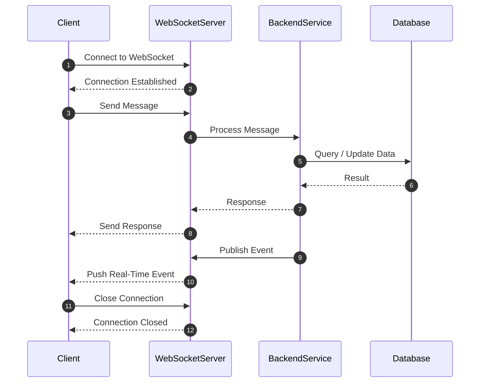

## Objective is Build web socketing app

```mermaid
sequenceDiagram
    autonumber
    participant Client
    participant WebSocketServer
    participant BackendService
    participant Database

    Client->>WebSocketServer: Connect to WebSocket
    WebSocketServer-->>Client: Connection Established

    Client->>WebSocketServer: Send Message
    WebSocketServer->>BackendService: Process Message
    BackendService->>Database: Query / Update Data
    Database-->>BackendService: Result
    BackendService-->>WebSocketServer: Response
    WebSocketServer-->>Client: Send Response

    BackendService->>WebSocketServer: Publish Event
    WebSocketServer-->>Client: Push Real-Time Event

    Client->>WebSocketServer: Close Connection
    WebSocketServer-->>Client: Connection Closed
```
## Tech stack
### Client : Angular App
### WebSocket Broker -> Active MQ

### Server app : Spring Boot

### Databse : MySQL

```mermaid
treeView-beta
            my-project/
                src/
                    main/
                         java/
                               App.java
                         test/
                              AppTest.java   
                .gitignore
                 pom.xml
                 README.md
```
